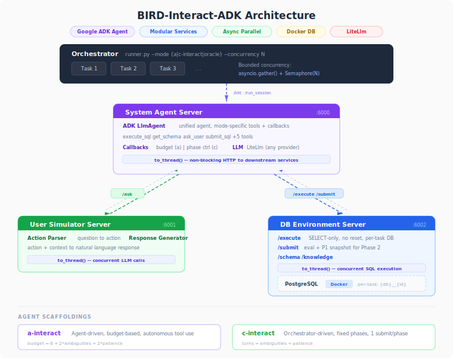

# BIRD-Interact-ADK

**Google ADK-based implementation of the [BIRD-Interact](https://bird-interact.github.io/) benchmark** — an interactive text-to-SQL evaluation framework with dynamic agent-environment interactions.

This is the official ADK agent implementation for running BIRD-Interact evaluations. It provides a modular, service-based architecture with parallel experiment execution, supporting both **Conversational Interaction (c-Interact)** and **Agentic Interaction (a-Interact)** modes.

> For the original BIRD-Interact benchmark, paper, leaderboard, and dataset details, see the [main repository](https://github.com/bird-bench/BIRD-Interact).

## Architecture

```
orchestrator/runner.py          Parallel evaluation runner (--mode, --concurrency)
        |
        ├── system_agent (6000)     Google ADK agent with tools + callbacks
        ├── user_simulator (6001)   Two-stage function-driven user simulator
        └── db_environment (6002)   SQL execution + evaluation + per-task DB isolation
                |
                └── PostgreSQL      BIRD-Interact databases (Docker)
```

<p align="center">
  
</p>

**Key features:**

- **Modular microservices** — three independent services communicating via HTTP. Deploy on different machines, swap any component (bring your own agent, user simulator, or DB backend), or scale services independently.
- **Extensible & research-friendly** — each service can be developed, tested, and replaced independently. Easy to plug in a new agent scaffold, experiment with different user simulation strategies, or adapt the evaluation environment for new tasks.
- **Unified ADK agent** — both c-interact and a-interact use the same `LlmAgent` with different tools and callbacks
- **Parallel execution** — `asyncio.Semaphore` + per-task DB copies for lock-free concurrency
- **Multi-provider LLM** — supports any [LiteLlm-compatible provider](https://docs.litellm.ai/docs/providers) (Anthropic, OpenAI, Ollama, etc.)
- **Per-task DB isolation** — each task gets its own database copy; SELECT-only enforcement for execute; Phase 1 snapshots for Phase 2
- **Budget system** — bird-coin tool costs (a-interact) and clarification turn limits (c-interact), both calculated per task from ambiguity count + patience
- **Phase control (c-interact)** — two-phase evaluation (P1 + follow-up P2), with one debug retry per phase

## Quick Start

### 1. Prerequisites

- Python 3.10+
- Docker (for PostgreSQL databases)

### 2. Set up PostgreSQL

If you already have the BIRD-Interact PostgreSQL container running (from the [original setup](https://github.com/bird-bench/BIRD-Interact)), you can reuse it directly — just ensure it's accessible on the configured port.

Otherwise, start the database:

```bash
docker compose up -d postgresql          # lite (18 DBs, 300 tasks)
docker compose up -d --profile full       # full (26 DBs, 600 tasks)
```

Wait for initialization to complete:

```bash
docker compose logs -f postgresql
# Look for: "database system is ready to accept connections"
```

### 3. Install dependencies

```bash
conda create -p ./.venv python=3.10 -y
source activate ./.venv
pip install -r requirements.txt
```

### 4. Configure

```bash
cp .env.example .env
# Edit .env with your settings:
#   - ANTHROPIC_API_KEY (or OPENAI_API_KEY for OpenAI models)
#   - SYSTEM_AGENT_MODEL / USER_SIM_MODEL
#   - DATASET: "lite" or "full"
```

### 5. Start services

```bash
bash scripts/start_services.sh
```

### 6. Run evaluation

```bash
# a-interact (agent mode) — 300 tasks, concurrency 3
python -m orchestrator.runner --mode a-interact --concurrency 3

# c-interact (conversational mode) — 300 tasks, concurrency 5
python -m orchestrator.runner --mode c-interact --concurrency 5

# Oracle test (ground-truth SQL, validates pipeline)
python -m orchestrator.runner --mode oracle --concurrency 5

# Specific tasks
python -m orchestrator.runner --mode a-interact --limit 10

# Full dataset
DATASET=full python -m orchestrator.runner --mode a-interact --concurrency 3
```

### 7. View results

```bash
# Generate HTML report
python -m orchestrator.report results/eval_a_interact.json

# Run test harness (validates endpoints without LLM calls)
python -m orchestrator.test_harness --concurrency 5
```

## LLM Configuration

LLM calls use [LiteLlm](https://docs.litellm.ai/docs/providers), which supports 100+ providers. Set the API key and model name in `.env`:

```env
# Anthropic
ANTHROPIC_API_KEY=sk-ant-...
SYSTEM_AGENT_MODEL=anthropic/claude-sonnet-4-20250514
USER_SIM_MODEL=anthropic/claude-haiku-4-5-20251001

# OpenAI
# OPENAI_API_KEY=sk-...
# SYSTEM_AGENT_MODEL=openai/gpt-4o
# USER_SIM_MODEL=openai/gpt-4o-mini

# Ollama (local)
# SYSTEM_AGENT_MODEL=ollama_chat/llama3:instruct
```

See [LiteLlm providers](https://docs.litellm.ai/docs/providers) for the full list.

## Dataset


| Version  | Tasks | Databases | PostgreSQL Image                                | HuggingFace                                                                      |
| -------- | ----- | --------- | ----------------------------------------------- | -------------------------------------------------------------------------------- |
| **Lite** | 300   | 18        | `shawnxxh/bird-interact-postgresql:latest`      | [bird-interact-lite](https://huggingface.co/datasets/birdsql/bird-interact-lite) |
| **Full** | 600   | 26        | `shawnxxh/bird-interact-postgresql-full:latest` | [bird-interact-full](https://huggingface.co/datasets/birdsql/bird-interact-full) |


### Download & Setup

1. Download the dataset from HuggingFace and place it in the repo root:
  ```bash
   # Lite
   git clone https://huggingface.co/datasets/birdsql/bird-interact-lite bird-interact-lite
   # Full
   git clone https://huggingface.co/datasets/birdsql/bird-interact-full bird-interact-full
  ```
2. **Ground Truth & Test Cases**: The public dataset does not include `sol_sql` and `test_cases` fields. To obtain them, email [bird.bench25@gmail.com](mailto:bird.bench25@gmail.com) with the tag `[bird-interact-lite GT&Test Cases]` or `[bird-interact-full GT&Test Cases]` in the subject. You will receive the GT file automatically.
3. Combine public data with GT:
  ```bash
   python scripts/combine_public_with_gt.py \
     bird-interact-lite/bird_interact_data.jsonl \
     /path/to/bird_interact_gt_kg_testcases.jsonl \
     bird-interact-lite/bird_interact_data.jsonl
  ```

Each dataset directory contains:

- `bird_interact_data.jsonl` — task definitions
- `{db_name}/` — per-database schema, column meanings, external knowledge

Set `DATASET=lite` or `DATASET=full` in `.env`.

## Project Structure

```
.
├── system_agent/           # ADK agent service (port 6000)
│   ├── agent.py            # Agent builder (c-interact / a-interact)
│   ├── server.py           # FastAPI endpoints
│   ├── adk_runtime.py      # ADK session management
│   ├── callbacks.py        # a-interact: budget, turn limits
│   ├── callbacks_cinteract.py  # c-interact: phase enforcement
│   └── tools.py            # 9 ADK tools
├── db_environment/         # DB service (port 6002)
│   └── server.py           # SQL execution, evaluation, per-task DB
├── user_simulator/         # User sim service (port 6001)
│   ├── server.py           # Two-stage simulator (action parser + response generator)
│   ├── prompts.py          # Prompt templates
│   └── sql_parser.py       # SQL segmentation
├── shared/                 # Shared utilities
│   ├── config.py           # Centralized settings
│   ├── llm.py              # LLM provider (LiteLlm)
│   ├── db_utils.py         # PostgreSQL pooling & evaluation
│   └── models.py           # Pydantic models
├── orchestrator/           # Evaluation runners
│   ├── runner.py           # Parallel runner (--mode, --concurrency, --oracle)
│   ├── cinteract.py        # c-interact pipeline
│   ├── ainteract.py        # a-interact pipeline
│   ├── report.py           # HTML report generator
│   └── test_harness.py     # Endpoint validation (no LLM)
├── bird-interact-lite/     # Lite dataset (300 tasks)
├── bird-interact-full/     # Full dataset (600 tasks)
├── docker-compose.yml      # PostgreSQL containers
├── scripts/                # Service startup scripts
├── .env.example            # Configuration template
└── requirements.txt
```

## Evaluation Modes

### a-interact (Agentic Interaction)

The agent autonomously decides which tools to use within a budget. Tools: `execute_sql`, `get_schema`, `get_column_meaning`, `get_knowledge_definition`, `ask_user`, `submit_sql`, etc.

Budget formula: `6 + 2 * num_ambiguities + 2 * patience`

### c-interact (Conversational Interaction)

Fixed workflow driven by the orchestrator:

1. **Phase 1**: Clarify (ask_user × N) → Submit SQL (once) → Debug if wrong (once)
2. **Phase 2**: Follow-up question → Submit SQL (once) → Debug if wrong (once)

### Oracle

Submits ground-truth SQL directly — validates the evaluation pipeline without LLM calls. Expected: ~96% P1, ~90% P2|P1.

## Results

Evaluated on BIRD-Interact-Lite (300 tasks), Claude Sonnet 4.5, patience=3, v1 user simulator prompt (claude-haiku-4-5):


| Mode                       | P1 (%) | P2 (%) | Avg Reward |
| -------------------------- | ------ | ------ | ---------- |
| **c-interact (ADK)**       | 44.67  | 30.67  | 0.395      |
| **c-interact (reference)** | 40.47  | 27.09  | —          |
| **a-interact (ADK)**       | 36.67  | 23.67  | 0.328      |
| **a-interact (reference)** | 37.67  | 22.00  | —          |


## License

MIT License. See [LICENSE](LICENSE).

## Citation

```bibtex
@inproceedings{
huo2026birdinteract,
title={{BIRD}-{INTERACT}: Re-imagining Text-to-{SQL} Evaluation via Lens of Dynamic Interactions},
author={Nan Huo and Xiaohan Xu and Jinyang Li and Per Jacobsson and Shipei Lin and Bowen Qin and Binyuan Hui and Xiaolong Li and Ge Qu and Shuzheng Si and Linheng Han and Edward Alexander and Xintong Zhu and Rui Qin and Ruihan Yu and Yiyao Jin and Feige Zhou and Weihao Zhong and Yun Chen and Hongyu Liu and Chenhao Ma and Fatma Ozcan and Yannis Papakonstantinou and Reynold Cheng},
booktitle={The Fourteenth International Conference on Learning Representations},
year={2026},
url={https://openreview.net/forum?id=nHrYBGujps}
}
```

## Acknowledgement

BIRD Team & Google Cloud. Built with [Google ADK](https://google.github.io/adk-docs/).