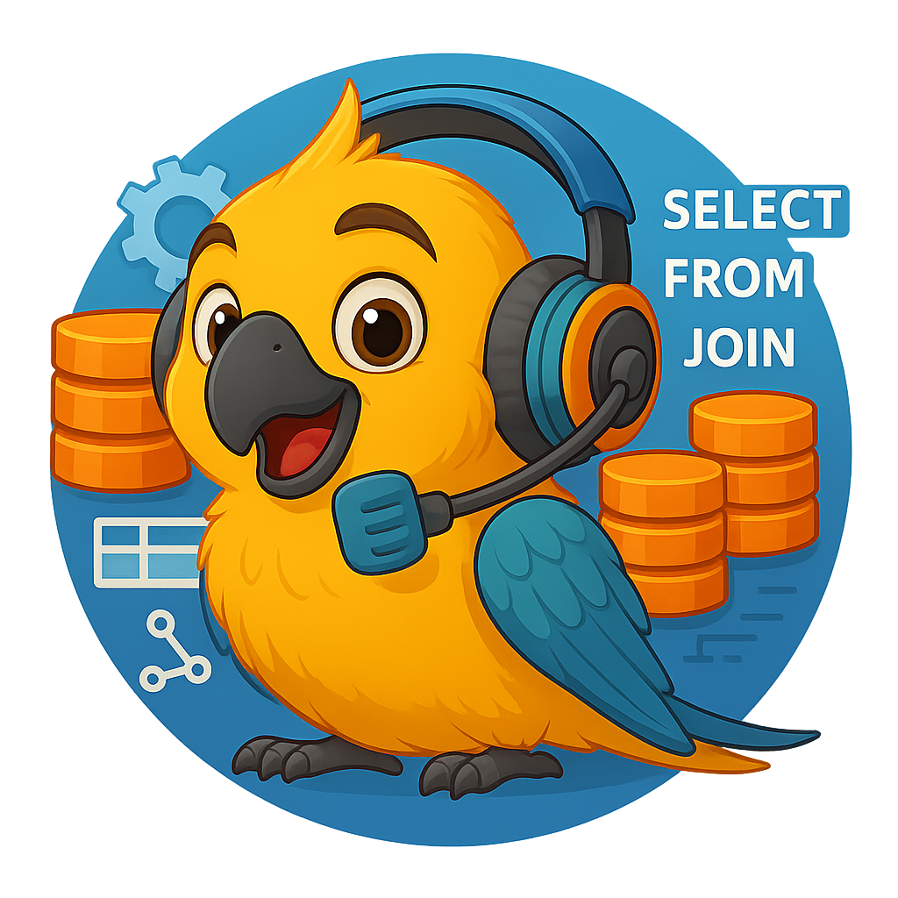
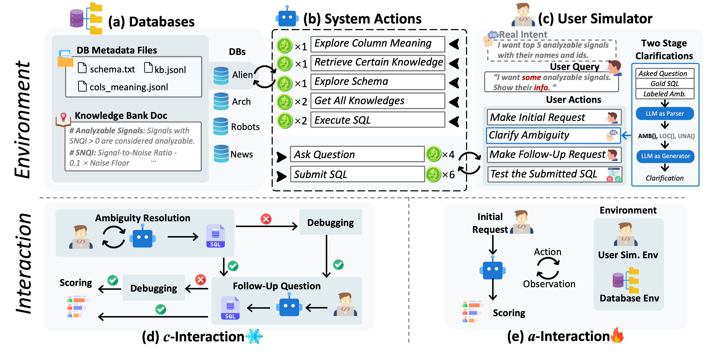

<div align="right">
  <details>
    <summary >🌐 Language</summary>
    <div>
      <div align="right">
        <p><a href="https://openaitx.github.io/view.html?user=bird-bench&project=BIRD-Interact&lang=en">English</a></p>
        <p><a href="https://openaitx.github.io/view.html?user=bird-bench&project=BIRD-Interact&lang=zh-CN">简体中文</a></p>
        <p><a href="https://openaitx.github.io/view.html?user=bird-bench&project=BIRD-Interact&lang=zh-TW">繁體中文</a></p>
        <p><a href="https://openaitx.github.io/view.html?user=bird-bench&project=BIRD-Interact&lang=ja">日本語</a></p>
        <p><a href="https://openaitx.github.io/view.html?user=bird-bench&project=BIRD-Interact&lang=ko">한국어</a></p>
        <p><a href="https://openaitx.github.io/view.html?user=bird-bench&project=BIRD-Interact&lang=hi">हिन्दी</a></p>
        <p><a href="https://openaitx.github.io/view.html?user=bird-bench&project=BIRD-Interact&lang=th">ไทย</a></p>
        <p><a href="https://openaitx.github.io/view.html?user=bird-bench&project=BIRD-Interact&lang=fr">Français</a></p>
        <p><a href="https://openaitx.github.io/view.html?user=bird-bench&project=BIRD-Interact&lang=de">Deutsch</a></p>
        <p><a href="https://openaitx.github.io/view.html?user=bird-bench&project=BIRD-Interact&lang=es">Español</a></p>
        <p><a href="https://openaitx.github.io/view.html?user=bird-bench&project=BIRD-Interact&lang=it">Itapano</a></p>
        <p><a href="https://openaitx.github.io/view.html?user=bird-bench&project=BIRD-Interact&lang=ru">Русский</a></p>
        <p><a href="https://openaitx.github.io/view.html?user=bird-bench&project=BIRD-Interact&lang=pt">Português</a></p>
        <p><a href="https://openaitx.github.io/view.html?user=bird-bench&project=BIRD-Interact&lang=nl">Nederlands</a></p>
        <p><a href="https://openaitx.github.io/view.html?user=bird-bench&project=BIRD-Interact&lang=pl">Polski</a></p>
        <p><a href="https://openaitx.github.io/view.html?user=bird-bench&project=BIRD-Interact&lang=ar">العربية</a></p>
        <p><a href="https://openaitx.github.io/view.html?user=bird-bench&project=BIRD-Interact&lang=fa">فارسی</a></p>
        <p><a href="https://openaitx.github.io/view.html?user=bird-bench&project=BIRD-Interact&lang=tr">Türkçe</a></p>
        <p><a href="https://openaitx.github.io/view.html?user=bird-bench&project=BIRD-Interact&lang=vi">Tiếng Việt</a></p>
        <p><a href="https://openaitx.github.io/view.html?user=bird-bench&project=BIRD-Interact&lang=id">Bahasa Indonesia</a></p>
      </div>
    </div>
  </details>

</div>

# BIRD-INTERACT 1.0  

<p align="center">
  
</p>


<div style="display: flex; justify-content: center; align-items: center; gap: 10px;">
  <a href="https://creativecommons.org/licenses/by-sa/4.0/deed.en">
    
  </a>
  <a href="https://bird-interact.github.io/">
    
  </a>
  <a href="https://huggingface.co/datasets/birdsql/bird-interact-lite/tree/main">
    
  </a>
  <a href="https://www.python.org/downloads/release/python-310/">
    
  </a>
  <a href="https://pypi.org/project/openai/">
    
  </a>
</div>

## ⚠️ Announcement  
Please note that before your evaluation process, when Docker loads the databases, errors may occasionally occur due to environment inconsistency (these will not terminate the process but will appear in the Docker logs). As a result, some databases may fail to load properly, leading to empty databases. This will cause the evaluation results to be abnormally low.  
👉 Therefore, we strongly recommend checking the Docker logs for any errors **before running the evaluation** and verifying that all databases have been successfully loaded.

👉 We have updated the **Submission Guidelines**, where the customized agent scaffolds are supported. Please feel free to take a look at our detailed submission guidelines [here](https://docs.google.com/document/d/1F1DSqHDBzGvXFlWU8iCl9otkqxIefgcH/edit?usp=sharing&ouid=108161566779099489782&rtpof=true&sd=true).

## 📰 News

- [2025-11-06] 🐛 **Bug Fix** & 🐳 **Docker update**: Update the sqlglot version to 26.16.4 to fix the bug that the sql parser cannot parse the SQL correctly for user simulator. You could fix this by re-install it by `pip install sqlglot==26.16.4` in the `bird_interact_eval` env. The `bird_interact_eval` image is also updated, so you could also pull it and recreate the `bird_interact_eval` container.

- [2025-10-21] 🐳 **Docker update**: We added the docker for Full DB Env. And we pushed 3 docker images (Base/Full DB Env and the evaluation environment for both `a-Interact` and `c-Interact`) to Docker Hub to facilitate the environment setup. No need to download the DB dumps and build the images manually!

- [2025-10-08] 📝 Our **[Bird-Interact paper](https://huggingface.co/papers/2510.05318)** is now publicly available!  
  It presents the full details, methodology, and evaluation of our interactive text-to-SQL benchmark.  
  👉 Check it out and know more about the ideas behind [BIRD-Interact](https://bird-interact.github.io/).

- [2025-08-26] 🚀 We're excited to announce the release of the **[BIRD-Interact-Full (600)](https://huggingface.co/datasets/birdsql/bird-interact-full)** set!  
It's a tough one — the best LLMs are only achieving a **16.33%** success rate, with just **10.0%** on the `c-interact` and `a-interact` portions.  
👉 For more details, please visit our [project website](https://bird-interact.github.io/).

- [2025-08-26] 📬 We'll be sending the **Ground Truth & Test cases** to our mailing list this week.  
If you want early access, please send an email as instructed on the site for an **automatic download**.  

- [2025-08-26] 💾 On another note, we've also released a SQLite version of **[LiveSQLBench-Lite](https://huggingface.co/datasets/birdsql/livesqlbench-base-lite-sqlite)** for easier local research.  
The full **LiveSQLBench-Base** and **-Large** versions are coming soon!

- [2025-08-22] **Bug Fix**: In Bird-Interact-Agent code, we fixed a bug that when evaluating phase-2 SQL, the stored phase-1 SQL cannot be executed successfully, leading to a lower success rate of Phase-2. This bug only affects those tasks where phase1 sql does some operations on the database, e.g. CREATE table, etc.

## 🧸 Overview

BIRD-INTERACT, an interactive text-to-SQL benchmark, **re-imagines Text-to-SQL evaluation via lens of dynamic interactions**.
The environment blends a hierarchical knowledge base, database documentation and a function-driven user simulator to recreate authentic enterprise environments across full **CRUD** operations.
It offers two rigorous test modes: (1) passive **Conversational Interaction** and (2) active **Agentic Interaction**, spanning 600 annotated tasks including Business Intelligence (BI), CRUD operations and etc., each guarded by executable test cases.
Typical evaluations trigger 1,968-5,496 interaction turns between model and user simulator, while state-of-the-art reasoning models currently solve only **≈24%** and **≈18%** of tasks, underscoring the benchmark's challenge.

<p align="center">
  
</p>

### ✅ Two Evaluation Modes

BIRD-INTERACT supports two evaluation modes as mentioned above:

   - **c-Interact**: Conversational Interaction which is a passive mode and the workflow is fixed. The code and detailed information can be found in `bird_interact_conv`.
   - **a-Interact**: Agentic Interaction which is an embodied active mode where the workflow is dynamic and led by models. The code and detailed information can be found in `bird_interact_agent`.


### 🐣 Lite Version

We are releasing a lite version of BIRD-INTERACT, `bird-interact-lite-exp`, which includes 270 high-quality real-world tasks specifically for PostgreSQL. This is a good starting point for quick experimentation. 

### 🦜 Full Version

The full version of BIRD-INTERACT, `bird-interact-full`, is a comprehensive benchmark that includes 600 tasks for PostgreSQL. It covers a wide range of SQL operations and user queries. The full version is coming soon.

### Model Performance Results on BIRD-INTERACT-FULL

#### 1. **c-Interact Text-to-SQL** Performance
| Rank | Model Name         | Normalized Reward | Avg Cost (USD)/Task | Level              |
|:----:|:-------------------|:-----------------:|:-------------------:|:------------------:|
| 1    | Gemini-2.5-Pro     | 20.92             | $0.04               | 🏆 Excellent Chat  |
| 2    | O3-Mini            | 20.27             | $0.07               | 🏆 Excellent Chat  |
| 3    | Claude-Sonnet-4    | 18.35             | $0.29               | 💎 Good Chat       |
| 4    | Qwen-3-Coder-480B  | 17.75             | $0.11               | 💎 Good Chat       |
| 5    | Deepseek-Chat-V3.1 | 15.15             | $0.12               | ✨ Standard        |
| 6    | Claude-Sonnet-3.7  | 13.87             | $0.29               | ✨ Standard        |
| 7    | GPT-5              | 12.58             | $0.08               | ⚪ Basic           |

#### 2. **a-Interact Text-to-SQL** Performance
| Rank | Model Name         | Normalized Reward | Avg Cost (USD)/Task | Level                    |
|:----:|:-------------------|:-----------------:|:-------------------:|:------------------------:|
| 1    | GPT-5              | 25.52             | $0.24               | 🏆 Excellent Interaction |
| 2    | Claude-Sonnet-4    | 23.28             | $0.51               | 🏆 Excellent Interaction |
| 3    | Claude-Sonnet-3.7  | 17.45             | $0.60               | 💎 Good Interaction      |
| 4    | Gemini-2.5-Pro     | 17.33             | $0.22               | 💎 Good Interaction      |
| 5    | O3-Mini            | 16.43             | $0.06               | ✨ Standard              |
| 6    | Deepseek-Chat-V3.1 | 13.47             | $0.06               | ✨ Standard              |
| 7    | Qwen-3-Coder-480B  | 10.58             | $0.07               | ⚪ Basic                 |

> \* Budget Parameters: Starting Budget/User Patience Budget, measured by our virtual currency *bird-coin*s . Refer to [bird_interact_agent/README.md](bird_interact_agent/README.md#task-setting) for more details.

### Interaction-Time Scaling (ITS)

Interaction-Time Scaling (ITS) refers to a model's ability to continuously increase its end performance through multi-turn interactions. When this interactive performance surpasses the model's idealized single-turn performance on a fully specified, unambiguous task, we say it satisfies the **ITS law**. As user patience grows and interaction turns accumulate, performance keeps improving, demonstrating that the model can sustain effective communication over extended dialogue. Currently, we only find claude-3-7-sonnet satisfies the ITS law.

<p align="center">
  
</p>

## Environment Setup

1. Run Docker containers for bird-interact-lite database, bird-interact-full database, and evaluation environment:
  
  > If you just want to evaluate on `bird-interact-lite`, you could comment out the [`postgresql_full` service](./env/docker-compose.yml#L21-L31) in `docker-compose.yml` to speed up the environment setup.
  
  Start the environment by running: 
   ```bash
   cd env
   docker compose pull 
   docker compose up -d
   ```
   Wait for several minutes for database initialization. 
   
  You could track the building progress by:
  ```bash
  docker compose logs -f --tail=100 bird_interact_postgresql_full # or bird_interact_postgresql for bird-interact-lite
  ```
  If finished, you should see the logs without errors like:

  ```bash
  bird_interact_postgresql_full  | 2025-10-28 17:58:30.413 HKT [1] LOG:  database system is ready to accept connection
  ```

  If you have created containers before and want to recreate it, you could run the following command:
  ```bash
  docker compose down -v # this cmd removes the containers and the volumes
  docker compose pull   # pull the latest images from Docker Hub
  docker compose up -d --force-recreate # build and start the containers again. --force-recreate means force the recreation of the containers. 
  # Or `docker compose up -d --force-recreate bird_interact_eval` to only recreate the bird_interact_eval container about evalution code environment.
  ```
   
   This runs 3 containers using prebuilt images from Docker Hub:
   - `bird_interact_postgresql`: PostgreSQL database for bird-interact-lite
   - `bird_interact_postgresql_full`: PostgreSQL database for bird-interact-full
   - `bird_interact_eval`: Evaluation environment for both `a-Interact` and `c-Interact`.

   Now, you could start the evaluation environment by executing the following command:
   ```bash
   docker compose exec bird_interact_eval bash
   ```

2. (Optional) Build the environment manually (if you want to build the images from scratch): 
   - Downdload the database dumps 
      - [bird-interact-lite](https://drive.google.com/file/d/1QIGQlRKbkqApAOrQXPqFJgUg8rQ7HRRZ/view). Unzip and rename it as `env/postgre_table_dumps`.
      - [bird-interact-full](https://drive.google.com/file/d/1V9SFIWebi27JtaDUAScG1xE9ELbYcWLR/view). Unzip and rename it as `env/postgre_table_dumps_full`.
   - Build the environment manually by running `docker-compose.build.yml`.
      ```bash
      cd env/
      docker compose -f docker-compose.build.yml build
      docker compose -f docker-compose.build.yml up -d
      ```

3. (Recommended) Check the database containers are built and running successfully.

-  Print the container build logs to ensure that the databases are built successfully without errors:
   ```bash 
   docker logs bird_interact_postgresql > build_bird_interact_postgresql.log 2>&1
   docker logs bird_interact_postgresql_full > build_bird_interact_postgresql_full.log 2>&1
   ```
   If errors occur, `"Errors occurred during import:"` will be printed in the log files.


-  Check if the database containers are in good shape.
   
   Use our provided Python script to verify database metadata:
   ```bash
   docker compose exec bird_interact_eval bash
   cd /app/env
   python check_db_metadata.py --host bird_interact_postgresql
   python check_db_metadata.py --host bird_interact_postgresql_full
   ```
   
   Expected results:
   - **bird-interact-lite**: 
     - 📈 Total Databases: 18
     - 📋 Total Tables: 175
     - 🔢 Total Columns: 2286
     - 📈 Avg Rows per Table: 1,038.48
     - 💾 Total Size: 207.15 MB (around)
   - **bird-interact-full**: 
     - 📈 Total Databases: 22
     - 📋 Total Tables: 244
     - 🔢 Total Columns: 2011
     - 📈 Avg Rows per Table: 1,121.19
     - 💾 Total Size: 272.00 MB (around)


## 📦 Dataset Details

### Dataset Description

- **Database:** The complete PostgreSQL database can be download from [bird-interact-lite](https://drive.google.com/file/d/1QIGQlRKbkqApAOrQXPqFJgUg8rQ7HRRZ/view) and [bird-interact-full](https://drive.google.com/file/d/1V9SFIWebi27JtaDUAScG1xE9ELbYcWLR/view).
- **data:** Each data instance contain the following main parts:
   - `selected_database`: The name of the database.  
   - `query`: The unambiguous user query.  
   - `amb_user_query`: The user query with injected ambiguities.
   - `user_query_ambiguity`: The ambiguities injected into the user query.
   - `non_critical_ambiguity`: The non-critical ambiguities like order, limit, etc.
   - `knowledge_ambiguity`: The ambiguities created by masked external knowledges. 
   - `sol_sql`: The ground truth SQL solution.  
   - `preprocess_sql`: SQL queries to run before executing the solution or prediction.  
   - `clean_up_sql`: SQL queries to run after the test cases to revert any changes made to the database.  
   - `test_cases`: A set of test cases to validate the predicted corrected SQL.
   - `follow_up`: The labeled follow up questions.
   - `external_knowledge`: The external knowledge related to the specific task.

- **evaluation:** The evaluation code is available in the [`./evaluation`](./evaluation) directory.
- **Curated by:** BIRD Team & Google Cloud
- **License:** [cc-by-sa-4.0](https://creativecommons.org/licenses/by-sa/4.0/)
- **HuggingFace Dataset Card:** [bird-interact-lite](https://huggingface.co/datasets/birdsql/bird-interact-lite)
  and [bird-interact-full](https://huggingface.co/datasets/birdsql/bird-interact-full)
### Dataset Uses

To avoid data leakage by auto-crawling, we do not include GT solution sqls and test cases along with data.
please email [bird.bench25@gmail.com](mailto:bird.bench25@gmail.com) with the tag `[bird-interact-lite GT&Test Cases]` or `[bird-interact-full GT&Test Cases]` in the title for ground truth and test cases for the bird-interact-lite or bird-interact-full dataset, which will be sent automatically.


### Combine the public data with the ground truth and test cases

Then use the following script to combine the public data with the ground truth and test cases:

Take the full version as an example:
(1) Run:
```bash
python combine_public_with_gt.py /path/to/bird-interact-full/bird_interact_data.jsonl /path/to/bird_interact_full_gt_kg_testcases_08022.jsonl /path/to/bird_interact_data.jsonl  # bird_interact_full_gt_kg_testcases_08022.jsonl is the data of ground-truth fields, which is obtained by emailing us.
```
This will create a new file at `/path/to/bird_interact_data.jsonl` with the combined data. 

(2) Then replace the original public data with the combined data:

```bash
cp /path/to/bird_interact_data.jsonl /path/to/bird-interact-full/bird_interact_data.jsonl
```

Same for the other versions: bird-interact-lite, mini version, etc. Just set correct paths for the public data and the ground truth and test cases, and then replace the public data with the combined data.


<!-- ### Use the Dataset from HuggingFace

You can download the dataset from HuggingFace using the following command:
```bash
from datasets import load_dataset
# Load the flash version of the dataset
dataset = load_dataset("birdsql/bird-interact-lite")
print(dataset["lite"][0])

# Load the full version of the dataset (coming soon)
dataset = load_dataset("birdsql/bird-interact-full")
print(dataset["full"][0])
```

Or you can use the provided script to download the full version of the dataset and split it into different dialects.
```bash
cd baseline/data
python pull_data.py \
  --schema_path path/to/full_schema.jsonl \
  --input_path path/to/input.jsonl \ # Path to the input JSONL file (may be empty if you want to download the dataset from HuggingFace)
  --output_folder path/to/output_dir # output folder of the split files
``` -->

## Folder Structure
```ultree
.
├── LICENSE
├── README.md
├── bird_interact_conv
│   ├── ...
│   └── README.md
├── bird_interact_agent
│   ├── ...
│   └── README.md
├── evaluation
│   ├── docker-compose.yml
│   ├── env
│   ├── postgre_table_dumps
│   ├── run
│   └── src
├── materials
│   ├── ...
└── requirements.txt
```
The details about running **a-interact** can be found in `./bird_interact_agent/README.md`; and **c-interact** can be found in `./bird_interact_conv/README.md`.

## 📋 Todo Lists

- [x] Release lite version, bird-interact-lite (270).
- [x] Release conversational version, bird-interact-conv.
- [x] Release agent version, bird-interact-agent.
- [x] Release Full bird-interact-full (600).
- [ ] SFT / RL an User Simulator

## Acknowledgement
We would like to express our sincere gratitude to **Irina Saparina**, **Mohammadreza Pourreza**, **Mehdi Bouzouina**, **Hailong Li**, **Jiatong Shi**, and Professor **Shinji Watanabe** for their fruitful discussions and valuable insights that helped improve this project.

## Created By:
BIRD Team & Google Cloud


## Change Log

- [2025-11-06] 🐛 **Bug Fix** & 🐳 **Docker update**: Update the sqlglot version to 26.16.4 to fix the bug that the sql parser cannot parse the SQL correctly for user simulator. You could fix this by re-install it by `pip install sqlglot==26.16.4` in the `bird_interact_eval` env. The `bird_interact_eval` image is also updated, so you could also pull it and recreate the `bird_interact_eval` container.
- [2025-10-21] 🐳 **Docker update**: Add the docker for Full DB Env. And we pushed 3 docker images (Base/Full DB Env and the evaluation environment for both `a-Interact` and `c-Interact`) to Docker Hub to facilitate the environment setup. No need to download the DB dumps and build the images manually! Please pull the latest images from Docker Hub and recreates the containers, e.g. using `docker compose down -v && docker compose pull && docker compose up -d --force-recreate`.
- [2025-08-22]  🐛 **Bug Fix**: Fix the bug that when evaluating phase-2 SQL, the stored phase-1 SQL cannot be executed successfully, leading to a lower success rate of Phase-2. This bug only affects those tasks where phase1 sql does some operations on the database, e.g. CREATE table, etc.