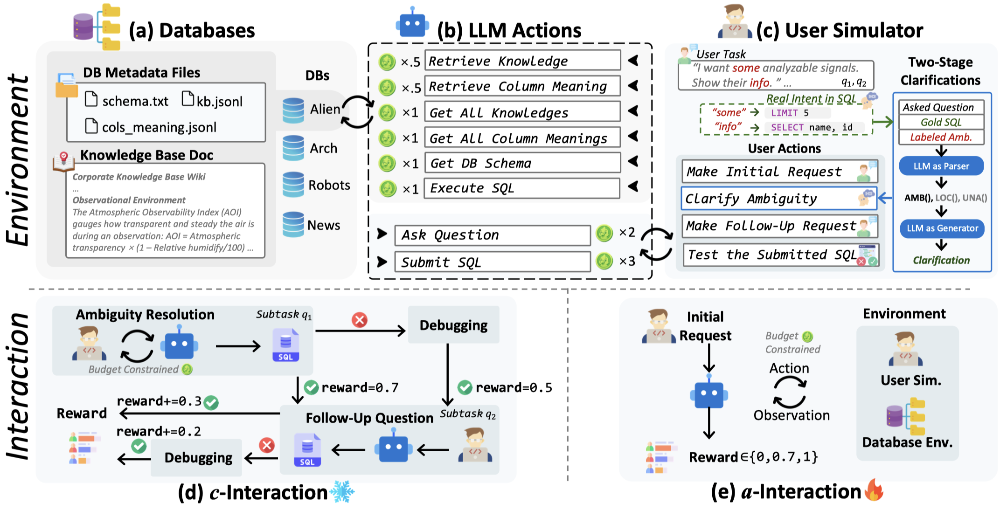

<div align="right">
  <details>
    <summary >🌐 Language</summary>
    <div>
      <div align="right">
        <p><a href="https://openaitx.github.io/view.html?user=bird-bench&project=BIRD-Interact&lang=en">English</a></p>
        <p><a href="https://openaitx.github.io/view.html?user=bird-bench&project=BIRD-Interact&lang=zh-CN">简体中文</a></p>
        <p><a href="https://openaitx.github.io/view.html?user=bird-bench&project=BIRD-Interact&lang=zh-TW">繁體中文</a></p>
        <p><a href="https://openaitx.github.io/view.html?user=bird-bench&project=BIRD-Interact&lang=ja">日本語</a></p>
        <p><a href="https://openaitx.github.io/view.html?user=bird-bench&project=BIRD-Interact&lang=ko">한국어</a></p>
        <p><a href="https://openaitx.github.io/view.html?user=bird-bench&project=BIRD-Interact&lang=hi">हिन्दी</a></p>
        <p><a href="https://openaitx.github.io/view.html?user=bird-bench&project=BIRD-Interact&lang=th">ไทย</a></p>
        <p><a href="https://openaitx.github.io/view.html?user=bird-bench&project=BIRD-Interact&lang=fr">Français</a></p>
        <p><a href="https://openaitx.github.io/view.html?user=bird-bench&project=BIRD-Interact&lang=de">Deutsch</a></p>
        <p><a href="https://openaitx.github.io/view.html?user=bird-bench&project=BIRD-Interact&lang=es">Español</a></p>
        <p><a href="https://openaitx.github.io/view.html?user=bird-bench&project=BIRD-Interact&lang=it">Itapano</a></p>
        <p><a href="https://openaitx.github.io/view.html?user=bird-bench&project=BIRD-Interact&lang=ru">Русский</a></p>
        <p><a href="https://openaitx.github.io/view.html?user=bird-bench&project=BIRD-Interact&lang=pt">Português</a></p>
        <p><a href="https://openaitx.github.io/view.html?user=bird-bench&project=BIRD-Interact&lang=nl">Nederlands</a></p>
        <p><a href="https://openaitx.github.io/view.html?user=bird-bench&project=BIRD-Interact&lang=pl">Polski</a></p>
        <p><a href="https://openaitx.github.io/view.html?user=bird-bench&project=BIRD-Interact&lang=ar">العربية</a></p>
        <p><a href="https://openaitx.github.io/view.html?user=bird-bench&project=BIRD-Interact&lang=fa">فارسی</a></p>
        <p><a href="https://openaitx.github.io/view.html?user=bird-bench&project=BIRD-Interact&lang=tr">Türkçe</a></p>
        <p><a href="https://openaitx.github.io/view.html?user=bird-bench&project=BIRD-Interact&lang=vi">Tiếng Việt</a></p>
        <p><a href="https://openaitx.github.io/view.html?user=bird-bench&project=BIRD-Interact&lang=id">Bahasa Indonesia</a></p>
      </div>
    </div>
  </details>

</div>

# BIRD-INTERACT 1.0  

<p align="center">
  
</p>


<div style="display: flex; justify-content: center; align-items: center; gap: 10px;">
  <a href="https://creativecommons.org/licenses/by-sa/4.0/deed.en">
    
  </a>
  <a href="https://bird-interact.github.io/">
    
  </a>
  <a href="https://huggingface.co/datasets/birdsql/bird-interact-lite/tree/main">
    
  </a>
  <a href="https://www.python.org/downloads/release/python-310/">
    
  </a>
  <a href="https://pypi.org/project/openai/">
    
  </a>
</div>

## ⚠️ Announcement  
Please note that during the evaluation process, when Docker loads the databases, errors may occasionally occur (these will not terminate the process but will appear in the Docker logs). As a result, some databases may fail to load properly, leading to empty databases. This will cause the evaluation results to be abnormally low.  
👉 Therefore, we strongly recommend checking the Docker logs for any errors **before running the evaluation** and verifying that all databases have been successfully loaded.

## 📰 News

- [2025-08-26] 🚀 We're excited to announce the release of the **[BIRD-Interact-Full (600)](https://huggingface.co/datasets/birdsql/bird-interact-full)** set!  
It's a tough one — the best LLMs are only achieving a **16.33%** success rate, with just **10.0%** on the `c-interact` and `a-interact` portions.  
👉 For more details, please visit our [project website](https://bird-interact.github.io/).

- [2025-08-26] 📬 We'll be sending the **Ground Truth & Test cases** to our mailing list this week.  
If you want early access, please send an email as instructed on the site for an **automatic download**.  

- [2025-08-26] 💾 On another note, we've also released a SQLite version of **[LiveSQLBench-Lite](https://huggingface.co/datasets/birdsql/livesqlbench-base-lite-sqlite)** for easier local research.  
The full **LiveSQLBench-Base** and **-Large** versions are coming soon!

- [2025-08-22] **Bug Fix**: In Bird-Interact-Agent code, we fixed a bug that when evaluating phase-2 SQL, the stored phase-1 SQL cannot be executed successfully, leading to a lower success rate of Phase-2. This bug only affects those tasks where phase1 sql does some operations on the database, e.g. CREATE table, etc.

## 🧸 Overview

BIRD-INTERACT, an interactive text-to-SQL benchmark, **re-imagines Text-to-SQL evaluation via lens of dynamic interactions**.
The environment blends a hierarchical knowledge base, database documentation and a function-driven user simulator to recreate authentic enterprise environments across full **CRUD** operations.
It offers two rigorous test modes: (1) passive **Conversational Interaction** and (2) active **Agentic Interaction**, spanning 600 annotated tasks including Business Intelligence (BI), CRUD operations and etc., each guarded by executable test cases.
Typical evaluations trigger 1,968-5,496 interaction turns between model and user simulator, while state-of-the-art reasoning models currently solve only **≈24%** and **≈18%** of tasks, underscoring the benchmark's challenge.

<p align="center">
  
</p>

### ✅ Two Evaluation Modes

BIRD-INTERACT supports two evaluation modes as mentioned above:

   - **c-Interact**: Conversational Interaction which is a passive mode and the workflow is fixed. The code and detailed information can be found in `bird_interact_conv`.
   - **a-Interact**: Agentic Interaction which is an embodied active mode where the workflow is dynamic and led by models. The code and detailed information can be found in `bird_interact_agent`.


### 🐣 Lite Version

We are releasing a lite version of BIRD-INTERACT, `bird-interact-lite-exp`, which includes 270 high-quality real-world tasks specifically for PostgreSQL. This is a good starting point for quick experimentation. 

### 🦜 Full Version

The full version of BIRD-INTERACT, `bird-interact-full`, is a comprehensive benchmark that includes 600 tasks for PostgreSQL. It covers a wide range of SQL operations and user queries. The full version is coming soon.

### Model Performance Results on BIRD-INTERACT Lite

#### 1. **c-Interact** Performance
| Rank | Model Name         | Normalized Reward | Level        |
|:------:|--------------------|:-------:|:--------------:|
| 1    | o3-mini            | 33.04 | 🏆 Excellent Chat |
| 2    | GPT-4o             | 30.33 | 💎 Good Chat      |
| 3    | Gemini-2.0-flash   | 27.41 | 💎 Good Chat      |
| 4    | Claude-3.7-sonnet  | 26.60 | ✨ Standard       |
| 5    | DeepSeek-R1        | 21.74 | ✨ Standard       |
| 6    | Qwen3              | 20.33 | ⚪ Basic          |
| 7    | DeepSeek-V3        | 15.85 | ⚪ Basic          |

#### 2. **a-Interact** Performance
| Rank | Model Name         | Budget Parameters* | Avg Steps/Task | Avg Cost (USD)/Task | Normalized Reward | Level            |
|:------:|--------------------|:-------------------:|:----------------:|:---------------------:|:-------------------:|:---------------------:|
| 1    | Claude-3.7-sonnet  | 6/6 | 15.4 | $0.6668 | 29.19 | 🏆 Excellent Interaction |
| 2    | o3-mini            | 6/6 | 7.8 | $0.0754 | 21.07 | 💎 Good Interaction      |
| 3    | DeepSeek-V3        | 6/6 | 15.6 | $0.0629 | 19.19 | 💎 Good Interaction      |
| 4    | Qwen3              | 6/6 | 12.5 | $0.0278 | 18.74 | ✨ Standard              |
| 5    | GPT-4o             | 6/6 | 15.3 | $0.4594 | 18.37 | ✨ Standard              |
| 6    | Gemini-2.0-flash   | 6/6 | 13.2 | $0.0337 | 17.26 | ⚪ Basic                 |
| 7    | DeepSeek-R1        | 6/6 | 12.0 | $0.0931 | 17.07 | ⚪ Basic                 |

> \* Budget Parameters: Starting Budget/User Patience Budget, measured by our virtual currency *bird-coin*s . Refer to [bird_interact_agent/README.md](bird_interact_agent/README.md#task-setting) for more details.

### Interaction-Time Scaling (ITS)

Interaction-Time Scaling (ITS) refers to a model's ability to continuously increase its end performance through multi-turn interactions. When this interactive performance surpasses the model's idealized single-turn performance on a fully specified, unambiguous task, we say it satisfies the **ITS law**. As user patience grows and interaction turns accumulate, performance keeps improving, demonstrating that the model can sustain effective communication over extended dialogue. Currently, we only find claude-3-7-sonnet satisfies the ITS law.

<p align="center">
  
</p>

## 📦 Dataset Details

### Dataset Description

- **Database:** The complete PostgreSQL database can be download from [the Google Drive](https://drive.google.com/file/d/1KABce6czIqL9kMyIX7i-_A0CIQoDnmyW/view). Check the [Quick Eval](#quick-eval) section for more details.
- **data:** Each data instance contain the following main parts:
   - `selected_database`: The name of the database.  
   - `query`: The unambiguous user query.  
   - `amb_user_query`: The user query with injected ambiguities.
   - `user_query_ambiguity`: The ambiguities injected into the user query.
   - `non_critical_ambiguity`: The non-critical ambiguities like order, limit, etc.
   - `knowledge_ambiguity`: The ambiguities created by masked external knowledges. 
   - `sol_sql`: The ground truth SQL solution.  
   - `preprocess_sql`: SQL queries to run before executing the solution or prediction.  
   - `clean_up_sql`: SQL queries to run after the test cases to revert any changes made to the database.  
   - `test_cases`: A set of test cases to validate the predicted corrected SQL.
   - `follow_up`: The labeled follow up questions.
   - `external_knowledge`: The external knowledge related to the specific task.

- **evaluation:** The evaluation code is available in the [`./evaluation`](./evaluation) directory.
- **Curated by:** BIRD Team & Google Cloud
- **License:** [cc-by-sa-4.0](https://creativecommons.org/licenses/by-sa/4.0/)
- **HuggingFace Dataset Card:** [bird-interact-lite](https://huggingface.co/datasets/birdsql/bird-interact-lite)

### Dataset Uses

To avoid data leakage by auto-crawling, we do not include GT solution sqls and test cases along with data.
please email [bird.bench25@gmail.com](mailto:bird.bench25@gmail.com) with the tag `[bird-interact-lite GT&Test Cases]` in title for full set, which will be sent automatically.


<!-- ### Use the Dataset from HuggingFace

You can download the dataset from HuggingFace using the following command:
```bash
from datasets import load_dataset
# Load the flash version of the dataset
dataset = load_dataset("birdsql/bird-interact-lite")
print(dataset["lite"][0])

# Load the full version of the dataset (coming soon)
dataset = load_dataset("birdsql/bird-interact-full")
print(dataset["full"][0])
```

Or you can use the provided script to download the full version of the dataset and split it into different dialects.
```bash
cd baseline/data
python pull_data.py \
  --schema_path path/to/full_schema.jsonl \
  --input_path path/to/input.jsonl \ # Path to the input JSONL file (may be empty if you want to download the dataset from HuggingFace)
  --output_folder path/to/output_dir # output folder of the split files
``` -->

## Folder Structure
```ultree
.
├── LICENSE
├── README.md
├── bird_interact_conv
│   ├── ...
│   └── README.md
├── bird_interact_agent
│   ├── ...
│   └── README.md
├── evaluation
│   ├── docker-compose.yml
│   ├── env
│   ├── postgre_table_dumps
│   ├── run
│   └── src
├── materials
│   ├── ...
└── requirements.txt
```
The details about running **a-interact** can be found in `./bird_interact_agent/README.md`; and **c-interact** can be found in `./bird_interact_conv/README.md`.

## 📋 Todo Lists

- [x] Release lite version, bird-interact-lite (270).
- [x] Release conversational version, bird-interact-conv.
- [x] Release agent version, bird-interact-agent.
- [x] Release Full bird-interact-full (600).
- [ ] SFT / RL an User Simulator

## Created By:
BIRD Team & Google Cloud


