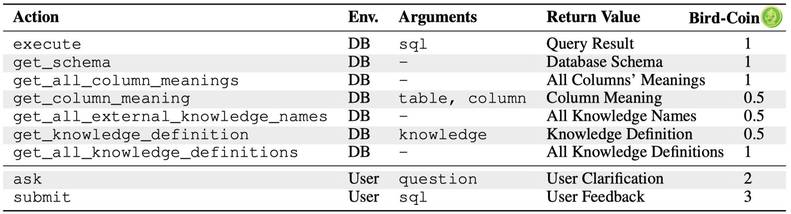

# Bird-Interact Agentic Evaluation 

This part is for running and evaluating BIRD-Interact Agent.

## Agentic Evaluation Setting
Here we introduce the agentic evaluation mode ($\alpha$-Interact) of BIRD-Interact.

### Task Setting
A task consists of two phases: an **ambiguous user query** (phase-1) followed by a **follow-up query** (phase-2). All these queries require the understanding of external knowledge. To complete these queries, agents could interact with two environments: a **Database Environment** and a **User Simulator Environment**. Each interaction is constrained by a **budget** measured in virtual *bird-coin*s , with different actions incurring varying *bird-coin*s . Only after phase-1 is completed, user will deliver the follow-up query. The rewards for phase-1 and phase-2 are 0.7 and 0.3 respectively. 

> **Why set budget?**: Agent has the risk of unlimited exploration behaviors (e.g. ReAct Agent may fall into infinite loop). This setting also helps explore Interaction-time scaling (budget ↑) and stress testing (budget ↓) behavious of Agent. Additinoally, it could test the agent's planning and decision making ability.


<p align="center">
  
</p>


### Environments and Action Space
Different from most studies only containing a working environment, our environment includes a **Database Env** and a **User Simulator Env**.
- [Database Env](src/envs/bird_interact_env/sql_env.py): A PostgreSQL database with a set of tables.
- [User Simulator Env](src/envs/user_simulator/us_env_bird_interact.py): A user simulator that can clarify ambiguities and test the submitted SQL from the Agent.

Our current agent baseline's action space and *bird-coin*s  are designed as follows:
<!-- figure  materials/actions.png-->


Heuristically, we set higher cost for those actions interacting with users, i.e. `ask` and `submit`.

### Budget Calculation
We set the budget case by case. 
- **Starting Budget** (adjustable parameter): First, we assign a "starting budget", (default **6** *bird-coin*s) for each task. 
- **Ambiguity Resolution Budget**: Then, for the task with many ambiguities, it may require more budget to finish the task. Thus, we assign **2** *bird-coin*s for each ambiguity of the user query. 
- **User Patience Budget** (adjustable parameter): Also, we introduce a adjustable *bird-coin*s to indicate the user patience, including four basic levels, **0**, **6**, **10**, **14** *bird-coin*s.


The total budget = starting budget + ambiguity resolution budget + user patience budget. You could find the budget calculation in batch-running implemented in [batch_run_bird_interact/main.py](batch_run_bird_interact/main.py#L110).

Current basic experiments are conducted with **Starting Budget** = **6** *bird-coin*s, **User Patience Budget** = **6** *bird-coin*s. Feel free to adjust these parameters to test different settings.


## Repository Structure

```
.
├── batch_run_bird_interact/    # Code for batch-running experiments (primary results)
├── src/                        # Core source code for single-run experiments
├── experiments/                # Main code for single-run experiments
├── data/                       # Dataset storage
├── outputs/                    # Experiment results: single-run and batch-run results
├── postgre_table_dumps/        # PostgreSQL database dumps
├── Dockerfile.postgresql       # PostgreSQL container configuration
├── Dockerfile.so_eval         # Evaluation environment configuration
├── docker-compose.yml         # Container orchestration
├── requirements.txt           # Python dependencies
├── run_batch_experiments.sh   # Batch experiment runner
└── run_experiment.sh          # Single experiment runner
```


## Environment Setup


1. Run Docker containers for both bird-interact-lite and bird-interact-full environments (using prebuilt images; no DB dumps downloading needed):
   ```bash
   cd bird_interact_agent
   docker compose pull 
   docker compose up -d
   ```
   This launches 3 containers using images from Docker Hub:
   - PostgreSQL database for bird-interact-lite
   - PostgreSQL database for bird-interact-full
   - Evaluation environment (so_eval_env)

2. (Optionally) Build the docker manually: You could also downdload the dumps from [bird-interact-lite](https://drive.google.com/file/d/1QIGQlRKbkqApAOrQXPqFJgUg8rQ7HRRZ/view) and [bird-interact-full](https://drive.google.com/file/d/1V9SFIWebi27JtaDUAScG1xE9ELbYcWLR/view) and then build the docker manually.

‼️ Please check the Docker build logs carefully to ensure that the databases are built without errors. Otherwise, you will not be able to reproduce our experimental results.


## Quick Start (BIRD-Interact-Lite)

### 1. Data Preparation

```bash
mkdir data && cd data
git clone https://huggingface.co/datasets/birdsql/bird-interact-lite
# Combine with GT fields (contact us for access) into bird_interact_data.jsonl
```

> To avoid data leakage by auto-crawling, we do not include GT solution sqls and test cases in `bird_interact_data.jsonl`. please email bird.bench25@gmail.com with the tag [bird-interact-lite GT&Test Cases] in title for full set, which will be sent automatically.


### 2. API Configuration

#### VertexAI Setup

> Current user simulator is based on gemini-2.0-flash-001, which is called by VertexAI. If you are new customer to google cloud, you will get [$300 in free credits](https://cloud.google.com/vertex-ai?hl=en), and could use it to call vertex API.

If you want to use VertexAI, you should configure in `src/llm_utils/call_api_batch.py` and `src/llm_utils/vertex_ai_simple.py`:
```python
GCP_PROJECT = "Your GCP Project ID"
GCP_REGION = "Your GCP Region"
GCP_CREDENTIALS_PATH = "Your GCP Credentials Path"
```
> If you find it hard to configure this, you could also try other API providers to use gemini-2.0-flash-001, or use other models.

#### OpenAI/Third-party API Setup
Configure in `src/llm_utils/config.py`:
- Set `base_url`
- Set `api_key`

### 3. Running Experiments

#### Start the Docker containers

```bash
cd bird_interact_agent
docker compose exec so_eval_env bash
```


#### Single Sample Mode
Single sample mode (`src/` and `experiments/`) is useful for debugging and workflow understanding
```bash
bash run_experiment.sh
```
Output directory: `outputs/single_runs/`

#### Batch Mode (recommend)
Batch mode (`batch_run_bird_interact/`) is recommended for production runs
```bash
bash run_batch_experiments.sh
```
Output directory: `outputs/batch_runs/`
Default user patience is set to 6.


## Quick Start (BIRD-Interact-Full)

The process of running experiments on the **Full** set is similar to that for the **Lite** set, with the following differences:

1. **Dataset**

   Use the Full dataset instead of the Lite one:
   🔗 [birdsql/bird-interact-full](https://huggingface.co/datasets/birdsql/bird-interact-full)

2. **Change Host to Full DB**: 
   - Change the host in `bird_interact_agent/src/config/db_config.py` from `bird_interact_postgresql` to `bird_interact_postgresql_full`. 
   
3. **User Simulator Prompt**

   The user simulator prompt used for the **Lite** set experiment is defined in [`prompts.py`](./src/envs/user_simulator/prompts.py).
   
   For the **Full** set experiment, use [`prompts_for_bird_interact_full.py`](./src/envs/user_simulator/prompts_for_bird_interact_full.py) instead.
   Therefore, you could update the import path in the code [prompt_utils.py](batch_run_bird_interact/prompt_utils.py) and [us_env_bird_interact.py](src/envs/user_simulator/us_env_bird_interact.py) to use `prompts_for_bird_interact_full.py` when running Full set experiments. 
