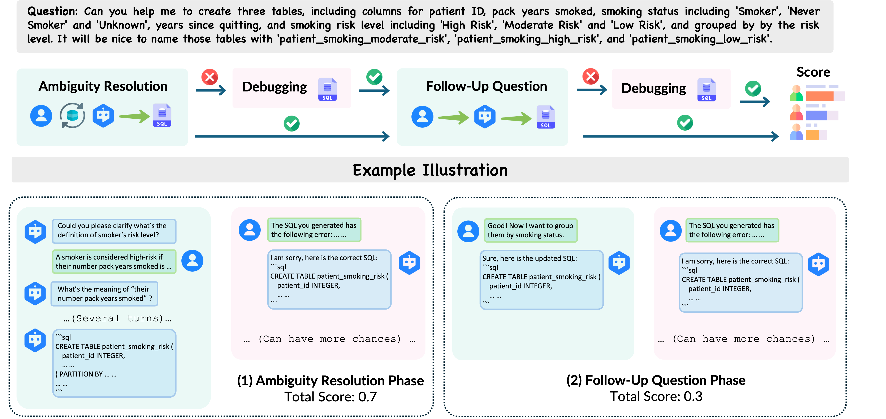

# Bird-Interact Conversational Module

This module implements the conversation-based interaction system for the BIRD-Interact project, focusing on natural language interactions with database systems.

## Overview
<p align="center">
  
</p>

**What is it?**  
A test that sees how well an evaluated system (S) can communicate with a user simulator (U) to solve user tasks via good SQL queries.

---

#### Step-by-step flow

1. **Ambiguous task**  
   *U* starts with a task with several ambiguities.

2. **Clarification round**  
   *S* can ask follow-up questions until it thinks it understands, then sends a SQL query.  
   • If the query is wrong, *S* gets one more chance (a “debugging”) to fix it.  
   • If both attempts fail, the test stops.

3. **Follow-up round**  
   If the first question was solved, *U* immediately asks a related follow-up query.  
   *S* writes a new SQL query and again has one debugging if needed.

4. **Turn limit**  
   The back-and-forth in the clarification round is limited by two things:  
   • how many ambiguity points were marked in the task, plus  
   • a small extra “user patience” (i.e., extra turns) allowance with the default being 3.

---

#### How scoring works

For a batch of tasks we count how many times *S* succeeds in each case:

| Situation | What counts as a win? | Reward added per win |
|-----------|----------------------|----------------------|
| Clarification, first try | Solved without using the debugging | **0.7** |
| Clarification, after debugging | Solved on the second try | **0.5** |
| Follow-up, first try | Solved without using the debugging | **0.3** |
| Follow-up, after debugging | Solved on the second try | **0.2** |

Add up the points and divide by the number of tasks.  
The closer the final number is to **1**, the better the system:

* High points = solves quickly with few mistakes.  
* Low points = needs debuggings or can’t solve at all.


## Directory Structure

```
bird_interact_conv/
├── code/
│   ├── sql_parser.py         # SQL query parsing utilities
│   ├── wrap_up_sql.py        # SQL query formatting and validation
│   ├── infer_api_system.py   # System-side API inference
│   ├── infer_api_user_1.py   # User simulation (first step)
│   ├── infer_api_user_2.py   # User simulation (second step)
│   ├── collect_response.py    # Response collection utilities
│   └── call_api.py           # API calling interface
├── pipeline/
│   └── run_gemini.sh         # Pipeline execution script
├── prompts/
│   └── prompts.py            # Conversation prompts and templates
├── data/
│   ├── datasets/             # Conversation datasets
│   └── DBs/                  # Database schemas
└── results/                  # Output directory for results
```

## Setup and Usage

### 1. Data Preparation

```bash
cd data
git clone https://huggingface.co/datasets/birdsql/bird-interact-lite
# Combine with GT fields (contact us for access) into bird_interact_data.jsonl
```

### 2. Environment Setup

1. Download the database dumps:
   - Get from: [Google Drive](https://drive.google.com/file/d/1KABce6czIqL9kMyIX7i-_A0CIQoDnmyW/view)
   - Move to working directory and rename to `postgre_table_dumps`

2. Build and run Docker containers:
   ```bash
   docker compose up --build
   ```
   This launches two containers:
   - PostgreSQL database
   - Evaluation environment (so_eval_env)

### 3. API Configuration

#### VertexAI Setup

> Current user simulator is based on gemini-2.0-flash-001, which is called by VertexAI. If you are new customer to google cloud, you will get [$300 in free credits](https://cloud.google.com/vertex-ai?hl=en), and could use it to call vertex API.

If you want to use VertexAI, you should configure in `src/llm_utils/call_api_batch.py` and `src/llm_utils/vertex_ai_simple.py`:
```python
GCP_PROJECT = "Your GCP Project ID"
GCP_REGION = "us-central1"
GCP_CREDENTIALS_PATH = "Your GCP Credentials Path"
```
> If you find it hard to configure this, you could also try other API providers to use gemini-2.0-flash-001, or use other models.

#### OpenAI/Third-party API Setup
Configure in `src/llm_utils/config.py`:
- Set `base_url`
- Set `api_key`

## Running Experiments

   ```bash
   # Run the conversation pipeline
   cd pipeline
   bash run_gemini.sh
   ```
Output directory: `results/`


## Components

### Code Module
- `sql_parser.py`: Handles parsing and validation of SQL queries
- `wrap_up_sql.py`: Formats and finalizes SQL queries
- `infer_api_system.py`: Manages system-side conversation logic
- `infer_api_user_1.py` & `infer_api_user_2.py`: Different user simulation strategies
- `collect_response.py`: Utilities for gathering and processing responses
- `call_api.py`: Interface for API interactions

### Pipeline
The `run_gemini.sh` script orchestrates the conversation flow, managing:
- User query processing
- System response generation
- SQL query execution
- Response collection and evaluation

### Prompts
The `prompts.py` file contains templates and prompts used for:
- User query generation
- System response formatting
- SQL query construction
- Error handling and clarification

### Results
Results from conversation runs are stored in the `results/` directory.


